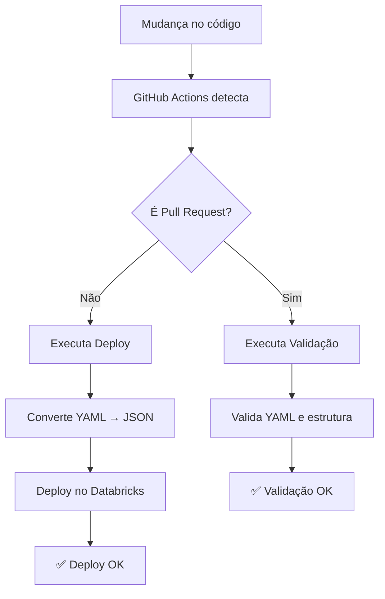

# 🚀 CI/CD Pipeline - Databricks MTG

Este documento explica como configurar e usar o pipeline de CI/CD para automatizar o deploy do pipeline de dados do Magic: The Gathering no Databricks.


## 📋 Pré-requisitos

### ✅ O que você precisa ter:

1. **Conta no Databricks** com permissões de administrador
2. **Token de acesso do Databricks** (Personal Access Token)
3. **Repositório GitHub** configurado
4. **Secrets configurados no GitHub**

### 🔑 Permissões Necessárias:

- **Databricks**: Admin ou Workspace Admin
- **GitHub**: Owner ou Admin do repositório
- **GitHub Actions**: Permissão para executar workflows

---

## 🔧 Configuração dos Secrets

### 1. Crie um Ambiente no GitHub

1. Vá para `Settings` > `Environments`
2. Clique em `New environment`
3. Nome: `Databricks`
4. Clique em `Configure environment`

### 2. Configure os Secrets no Ambiente

1. No ambiente `Databricks`, vá para `Environment secrets`
2. Clique em `Add secret`

### 3. Configure os secrets necessários

| Secret Name | Descrição | Exemplo |
|-------------|-----------|---------|
| `DATABRICKS_HOST` | URL do workspace do Databricks | `https://adb-xxxxxxxx.xx.azuredatabricks.net` |
| `DATABRICKS_TOKEN` | Personal Access Token do Databricks | `dapiXXXXXXXXXXXXXXXXXXXXXXXXXXXXXXXX` |

### 4. Como obter o DATABRICKS_TOKEN

1. No Databricks, vá para `User Settings` (ícone de usuário)
2. Clique em `Developer`
3. Clique em `Generate new token`
4. Copie o token gerado
5. **⚠️ Importante**: Guarde o token em local seguro, ele não será mostrado novamente

---

## 🚀 Como Funciona o CI/CD

### 🔄 Fluxo de Execução



### 🎯 Ambientes e Segurança

- ✅ **Ambiente**: `Databricks` configurado no GitHub
- ✅ **Secrets**: Armazenados de forma segura no ambiente
- ✅ **Acesso**: Controlado por permissões do ambiente

### 📁 Trigger do Pipeline

O pipeline é executado automaticamente quando:

- ✅ **Push** para a branch `main`
- ✅ **Pull Request** para a branch `main`
- ✅ **Mudanças** em arquivos específicos:
  - `src/**` (qualquer arquivo na pasta src)
  - `.github/workflows/magic-deploy.yml`
  - `.github/DAGs/magic.yml`
  - `.github/scripts/**` (scripts de deploy e validação)

---

## 🔄 Pipeline de Dados

### 📊 Estrutura do Pipeline

```
STAGING → BRONZE → SILVER → GOLD
   ↓        ↓        ↓       ↓
Ingestão → Raw → Clean → Analytics
```

### 🔗 Dependências entre Tasks

- **Staging**: Execução paralela de todas as ingestões
- **Bronze**: Depende do respectivo staging
- **Silver**: Depende do respectivo bronze
- **Gold**: Depende de múltiplas tabelas silver

### ⚡ Otimizações Delta

- ✅ Delta Preview habilitado
- ✅ Otimização de escrita automática
- ✅ Auto-compactação habilitada

---

## 🖥️ Configurações de Cluster

### 📊 DESENVOLVIMENTO (ATUAL)

```yaml
# Configuração atual em .github/DAGs/magic.yml
node_type_id: "m5d.large"      # 2 vCPUs, 8GB RAM
is_single_node: true           # Single node
autoscale:
  min_workers: 1               # Mínimo 1 worker
  max_workers: 2               # Máximo 2 workers
```

**📈 Especificações:**
- **vCPUs**: 2
- **RAM**: 8GB
- **Custo**: ~$0.25/hora
- **Tempo estimado**: 2-3 horas (1000+ páginas)
- **Uso**: Desenvolvimento, testes, validação

---

### 🚀 PRODUÇÃO RECOMENDADA

```yaml
# Configuração recomendada para produção
node_type_id: "m5d.2xlarge"    # 8 vCPUs, 32GB RAM
is_single_node: false          # Multi-node
autoscale:
  min_workers: 3               # Mínimo 3 workers
  max_workers: 6               # Máximo 6 workers
```

**📈 Especificações:**
- **vCPUs**: 8
- **RAM**: 32GB
- **Custo**: ~$1.00/hora
- **Tempo estimado**: 30-45 minutos (1000+ páginas)
- **Uso**: Produção, ingestão intensiva

---

### 💰 ALTERNATIVA ECONÔMICA

```yaml
# Configuração econômica para produção
node_type_id: "m5d.large"      # 2 vCPUs, 8GB RAM
is_single_node: false          # Multi-node
autoscale:
  min_workers: 2               # Mínimo 2 workers
  max_workers: 3               # Máximo 3 workers
```

**📈 Especificações:**
- **vCPUs**: 2
- **RAM**: 8GB
- **Custo**: ~$0.25/hora
- **Tempo estimado**: 1.5-2 horas (1000+ páginas)
- **Uso**: Produção com orçamento limitado

---

### 🎯 Comparação de Performance

| Configuração | Tempo | Custo/Execução | Recomendação |
|--------------|-------|----------------|--------------|
| **Desenvolvimento** | 2-3 horas | $0.50-$0.75 | ❌ Muito lento |
| **Produção** | 1-1.5 horas | $0.50-$0.75 | ⚠️ Aceitável |
| **Alta Performance** | 30-45 min | $0.50-$0.75 | ✅ **RECOMENDADO** |
| **Econômica** | 1.5-2 horas | $0.38-$0.50 | 💰 Alternativa |

### 🔄 Como Migrar para Produção

1. **Edite** o arquivo `.github/DAGs/magic.yml`
2. **Altere** as configurações do cluster:
   ```yaml
   node_type_id: "m5d.2xlarge"  # Para alta performance
   is_single_node: false        # Multi-node
   autoscale:
     min_workers: 3
     max_workers: 6
   ```
3. **Commit e push** para `main`
4. **GitHub Actions** fará o deploy automaticamente
5. **Monitore** a performance

---

## 🕐 Agendamento

### ⏰ Configuração Atual

O pipeline está configurado para executar:
- **Frequência**: Diariamente
- **Horário**: 06:00 (America/Sao_Paulo)
- **Status**: UNPAUSED (ativo)

### 📅 Cron Expression

```
"0 0 6 * * ?"
│ │ │ │ │ │ │
│ │ │ │ │ │ └─ Ano (opcional)
│ │ │ │ │ └─── Dia da semana (opcional)
│ │ │ │ └───── Mês
│ │ │ └─────── Dia do mês
│ │ └───────── Hora
│ └─────────── Minuto
└───────────── Segundo
```

### 🔧 Como Alterar o Agendamento

1. Edite o arquivo `.github/DAGs/magic.yml`
2. Localize a seção `schedule`
3. Modifique o `quartz_cron_expression`
4. Commit e push para `main`

---

## 🛠️ Comandos Úteis

### 📊 Verificar Status do Job

```bash
# Listar todos os jobs
databricks jobs list --output JSON

# Filtrar apenas o MTG_PIPELINE
databricks jobs list --output JSON | jq -r '.jobs[] | select(.settings.name == "MTG_PIPELINE")'
```

### ▶️ Executar Job Manualmente

```bash
# Executar job específico
databricks jobs run-now --job-id <JOB_ID>

# Executar e aguardar conclusão
databricks jobs run-now --job-id <JOB_ID> --wait
```

### 📋 Ver Logs de Execução

```bash
# Ver detalhes de uma execução
databricks jobs get-run --run-id <RUN_ID>

# Ver logs de uma execução
databricks jobs get-run-output --run-id <RUN_ID>
```

### ⏸️ Pausar/Despausar Job

```bash
# Pausar job
databricks jobs pause --job-id <JOB_ID>

# Despausar job
databricks jobs unpause --job-id <JOB_ID>
```

### 🔄 Deploy Manual

```bash
# Deploy via script Python
python .github/scripts/deploy.py

# Deploy direto via CLI
databricks jobs create --json @.github/DAGs/magic.json
```

---

## 🔍 Monitoramento

### 📈 GitHub Actions

- **Acesse**: Aba `Actions` no repositório
- **Visualize**: Histórico de deploys
- **Verifique**: Logs de erro
- **Configure**: Notificações de falha

### 🏢 Databricks

- **Acesse**: `Jobs` no workspace
- **Monitore**: Execuções em tempo real
- **Configure**: Alertas de falha
- **Analise**: Métricas de performance

### 📊 Métricas Importantes

- **Tempo de execução** por task
- **Taxa de sucesso** do pipeline
- **Uso de recursos** do cluster
- **Frequência de falhas**

---

## 🚨 Troubleshooting

### ❌ Erro: "Invalid YAML"

**Sintomas:**
- Workflow falha na validação
- Erro de sintaxe YAML

**Solução:**
1. Verifique a sintaxe do `magic.yml`
2. Use um validador YAML online
3. Verifique indentação e caracteres especiais

### 🔐 Erro: "Authentication failed"

**Sintomas:**
- Erro 401/403 no deploy
- Falha de autenticação

**Solução:**
1. Verifique se os secrets estão configurados
2. Confirme se o token não expirou
3. Verifique permissões no Databricks

### 🔍 Erro: "Job not found"

**Sintomas:**
- Erro ao tentar atualizar job
- Job não existe no Databricks

**Solução:**
1. O job será criado automaticamente na primeira execução
2. Verifique se o nome do job está correto
3. Execute deploy manual se necessário

### ⚡ Erro: "Cluster not available"

**Sintomas:**
- Falha ao iniciar cluster
- Timeout na criação

**Solução:**
1. Verifique as configurações do cluster
2. Confirme se há recursos disponíveis na conta
3. Verifique limites de quota

### 📁 Erro: "Notebook not found"

**Sintomas:**
- Falha na validação de paths
- Notebook não encontrado

**Solução:**
1. Verifique se o notebook existe no caminho especificado
2. Confirme se o path está correto no `magic.yml`
3. Verifique se o arquivo foi commitado

---

## 📞 Suporte

### 🆘 Onde Buscar Ajuda

Para problemas relacionados ao:

- **GitHub Actions**: Verifique os logs na aba Actions
- **Databricks**: Consulte a documentação oficial
- **Pipeline de dados**: Verifique os logs de execução no Databricks

### 📚 Recursos Úteis

- [GitHub Actions Documentation](https://docs.github.com/en/actions)
- [Databricks CLI Documentation](https://docs.databricks.com/dev-tools/cli/index.html)
- [Databricks Jobs API](https://docs.databricks.com/dev-tools/api/latest/jobs.html)

### 🐛 Como Reportar Bugs

1. **Capture logs** completos do erro
2. **Descreva** o que estava tentando fazer
3. **Inclua** contexto do ambiente
4. **Mencione** se é reproduzível

---

## 🔄 Atualizações

### 📝 Como Atualizar o Pipeline

1. **Faça as mudanças** nos notebooks
2. **Commit e push** para `main`
3. **GitHub Actions** fará o deploy automaticamente
4. **Monitore** a execução
5. **Verifique** se tudo funcionou

### 🔄 Processo de Deploy

```
Desenvolvimento → Teste → Validação → Deploy → Monitoramento
     ↓              ↓         ↓         ↓         ↓
   Notebooks    Validação   GitHub   Databricks  Logs
```

---

## 📊 Status do Projeto

### ✅ Funcionalidades Implementadas

- [x] CI/CD automatizado
- [x] Validação de YAML
- [x] Deploy inteligente (criar/atualizar)
- [x] Monitoramento de execução
- [x] Tratamento de erros
- [x] Documentação completa
